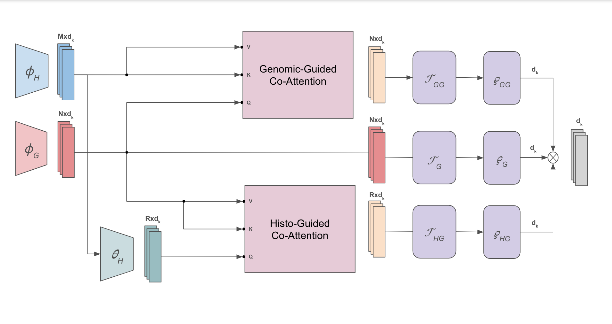

# multimodal-path-omic
A suite of multimodal models for histological WSI and omics data integration and analysis

## Multimodal Co-Attention Transformer (MCAT)

## Multimodal Double Co-Attention Transformer (MDCAT)
