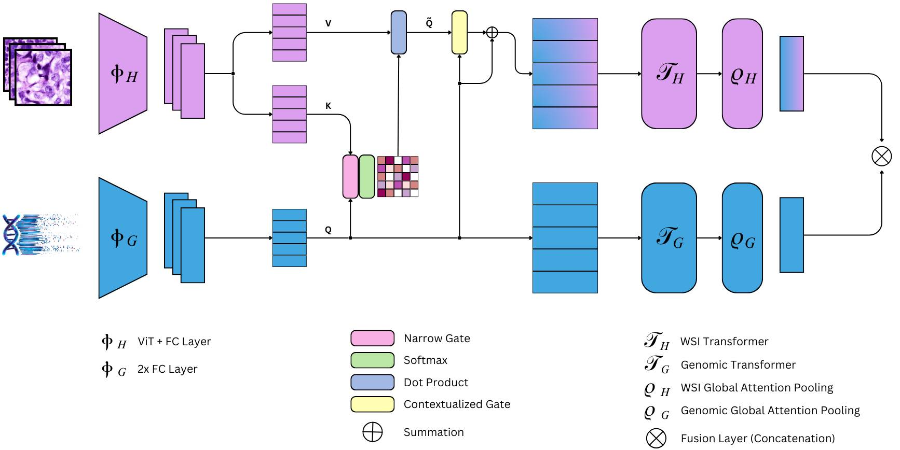
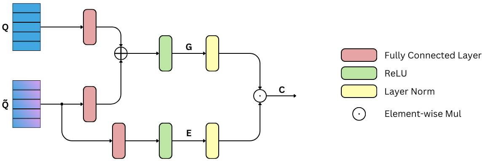

# multimodal-path-omic
A suite of multimodal models for histopathological images and omics data integration and analysis

## Multimodal Co-Attention Transformer (MCAT)


## Narrow Contextual Attention Gate Transformer (NaCAGaT)



## How to run
For SLURM environments, create a `.sbatch` file inside `models/<model>`. Here an example of `.sbatch` file:

```
#!/bin/bash
#SBATCH --job-name=nacagat_main
#SBATCH --mail-type=END,FAIL
#SBATCH --mail-user=<email>
#SBATCH --account=<account>
#SBATCH --partition=<partition>
#SBATCH --time=360
#SBATCH --mem=16G
#SBATCH --gres=gpu:1
#SBATCH --output=logs/last.run.log
#SBATCH --err=logs/last.run.error.log

echo "Job "$SLURM_JOB_ID" started" >> logs/run.$SLURM_JOB_ID.log
export PYTHONPATH=/work/tesi_mgualtieri/decider/multimodal-path-omic:$PYTHONPATH
eval "$(conda shell.bash hook)"
conda activate torch
echo "Environment conda activated" >> logs/run.$SLURM_JOB_ID.log
python main.py >> logs/run.$SLURM_JOB_ID.log
```

To change the configuration of the model, edit the `config/config.yaml` file.